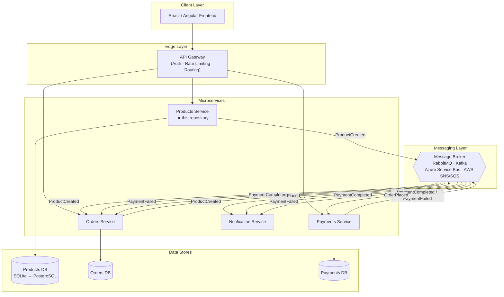
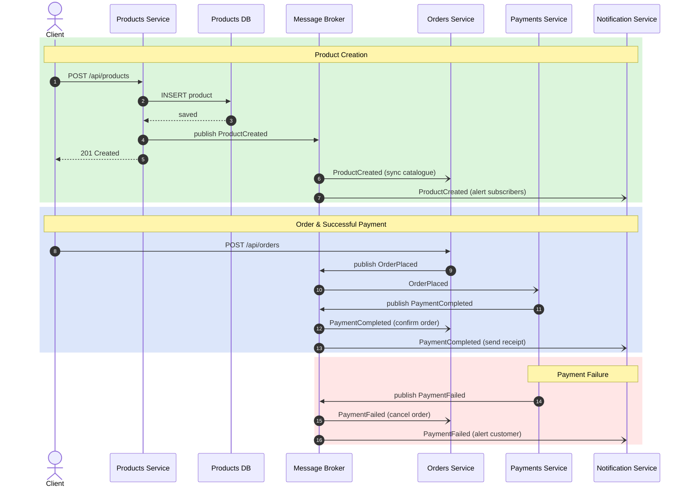

# Products Service API


## Table of Contents

1. [Solution Structure](#solution-structure)
2. [Getting Started](#getting-started)
3. [Running with Docker](#running-with-docker)
4. [API Reference](#api-reference)
5. [Architecture](#architecture)
6. [Event-Driven Architecture](#event-driven-architecture)
7. [Swapping to a Real Message Broker](#swapping-to-a-real-message-broker)
8. [Production Hardening](#production-hardening)
9. [Running Tests](#running-tests)
10. [Configuration](#configuration)

---

## Solution Structure

```
productsService_API/
├── src/
│   ├── Products.Domain/            # Entities, value objects — zero dependencies
│   ├── Products.Application/       # Use-cases, interfaces, DTOs, integration events
│   ├── Products.Infrastructure/    # EF Core, JWT, event publishers, seeding
│   └── Products.Api/               # ASP.NET Core controllers, middleware, Program.cs
└── tests/
    ├── Products.UnitTests/         # 21 xUnit tests — validators, domain, service
    └── Products.IntegrationTests/  # 14 xUnit tests — full HTTP pipeline via WebApplicationFactory
```

---

## Getting Started

```bash
# Restore and run (SQLite file created automatically on first run)
dotnet run --project src/Products.Api

# Swagger UI (development only)
open http://localhost:5062/swagger
```

Demo credentials for the Swagger "Authorize" button:

| Username | Password    |
|----------|-------------|
| admin    | Admin@12345 |

---

## Running with Docker

### Quick start

```bash
# 1. Create a .env file with your JWT secret (never commit this file)
echo "JWT_KEY=replace-with-a-strong-random-secret-min-32-chars" > .env

# 2. Build and start
docker compose up --build

# 3. Health check
curl http://localhost:8080/health

# 4. Login
curl -s -X POST http://localhost:8080/api/auth/login \
  -H "Content-Type: application/json" \
  -d '{"username":"admin","password":"Admin@12345"}' | jq .
```

The SQLite database is persisted in a named Docker volume (`products-data`).

### CORS in Docker

Add allowed frontend origins to the `.env` file:

```env
JWT_KEY=your-secret-here
ALLOWED_ORIGIN_0=https://your-frontend.example.com
```

Or set them inline:

```bash
docker compose run -e "Cors__AllowedOrigins__0=https://app.example.com" products-api
```

### Production deployment notes

| Concern | Recommendation |
|---------|----------------|
| TLS | Terminate at an ingress controller or reverse proxy (nginx, Traefik). The container listens on HTTP port 8080. |
| Secrets | Use Docker Secrets, AWS Secrets Manager, Azure Key Vault, or Kubernetes Secrets — not environment variables in compose files. |
| Database | Replace SQLite with PostgreSQL or SQL Server for multi-instance deployments. Change the connection string and EF Core provider. |
| Migrations | Run `dotnet ef database update` as a separate init container or migration job before rolling out new API replicas. |
| Logging | Container stdout is captured by the container runtime. Configure a log aggregator (Seq, ELK, CloudWatch, Datadog) as a Serilog sink. |

---

## API Reference

| Method   | Endpoint                   | Auth     | Description                          |
|----------|----------------------------|----------|--------------------------------------|
| `GET`    | `/health`                  | None     | Service health status                |
| `POST`   | `/api/auth/login`          | None     | Exchange credentials for a JWT       |
| `GET`    | `/api/products`            | Bearer   | List products (optional `?colour=`)  |
| `GET`    | `/api/products/{id}`       | Bearer   | Get product by ID (404 if missing)   |
| `POST`   | `/api/products`            | Bearer   | Create product (201 + Location)      |
| `PUT`    | `/api/products/{id}`       | Bearer   | Update product details and stock     |
| `DELETE` | `/api/products/{id}`       | Bearer   | Delete product (204 No Content)      |

All validation errors return `422 Unprocessable Entity` with a structured error list.

---

## Architecture

### System Context

The Products Service is one node in a broader microservices landscape. An API Gateway routes client traffic, and a Message Broker propagates domain events to downstream services.



### Event Flow

The sequence below shows three flows: product creation, a successful order, and a failed payment.



### Integration Events (this service)

| Event                       | Trigger                        | Consumers (example)          |
|-----------------------------|--------------------------------|------------------------------|
| `ProductCreatedIntegrationEvent` | Product successfully saved | Orders Service, Notification Service |

The event contract lives in `Products.Application/Events/` — an Application-layer concern with no infrastructure dependency.

---

## Event-Driven Architecture

### How It Works Today

When `ProductService.CreateAsync` successfully persists a product it immediately calls:

```csharp
await _eventPublisher.PublishAsync(
    new ProductCreatedIntegrationEvent(
        product.Id, product.Name, product.Colour, product.Price, now),
    cancellationToken);
```

`IEventPublisher` is injected by DI. The controller and the service have **no knowledge** of which implementation is registered — only the DI bootstrap does.

### Available Implementations

| Class | Behaviour | When to use |
|-------|-----------|-------------|
| `LoggingEventPublisher` | Logs the event as a Serilog structured entry | Development, CI, any environment without a broker |
| `NoOpEventPublisher` | Silently discards the event | When logging the event would add unwanted noise |
| *(your broker adapter)* | Publishes to RabbitMQ / Kafka / ASB / SNS | Production / staging |

The registered implementation is the only line that changes when you add a real broker.

```csharp
// InfrastructureServiceExtensions.cs  — current (development)
services.AddScoped<IEventPublisher, LoggingEventPublisher>();

// Swap to silent no-op
services.AddScoped<IEventPublisher, NoOpEventPublisher>();

// Swap to your broker adapter (see below)
services.AddScoped<IEventPublisher, RabbitMqEventPublisher>();
```

---

## Swapping to a Real Message Broker

Create a class that implements `IEventPublisher` in `Products.Infrastructure/Events/` and update the single DI line above. The rest of the codebase is unchanged.

### RabbitMQ (via MassTransit)

```bash
dotnet add package MassTransit.RabbitMQ
```

```csharp
// Program.cs / InfrastructureServiceExtensions.cs
services.AddMassTransit(x =>
{
    x.UsingRabbitMq((ctx, cfg) =>
    {
        cfg.Host("rabbitmq://localhost");
        cfg.ConfigureEndpoints(ctx);
    });
});

// Adapter
internal sealed class MassTransitEventPublisher(IPublishEndpoint endpoint) : IEventPublisher
{
    public Task PublishAsync<TEvent>(TEvent @event, CancellationToken ct = default)
        where TEvent : class => endpoint.Publish(@event, ct);
}
```

### Apache Kafka (via Confluent.Kafka)

```bash
dotnet add package Confluent.Kafka
```

```csharp
internal sealed class KafkaEventPublisher(IProducer<Null, string> producer) : IEventPublisher
{
    public async Task PublishAsync<TEvent>(TEvent @event, CancellationToken ct = default)
        where TEvent : class
    {
        var topic = typeof(TEvent).Name; // "ProductCreatedIntegrationEvent"
        var json  = JsonSerializer.Serialize(@event);
        await producer.ProduceAsync(topic, new Message<Null, string> { Value = json }, ct);
    }
}
```

### Azure Service Bus

```bash
dotnet add package Azure.Messaging.ServiceBus
```

```csharp
internal sealed class ServiceBusEventPublisher(ServiceBusSender sender) : IEventPublisher
{
    public async Task PublishAsync<TEvent>(TEvent @event, CancellationToken ct = default)
        where TEvent : class
    {
        var json    = JsonSerializer.Serialize(@event);
        var message = new ServiceBusMessage(json)
        {
            Subject             = typeof(TEvent).Name,
            ContentType         = "application/json",
            MessageId           = Guid.NewGuid().ToString(),
        };
        await sender.SendMessageAsync(message, ct);
    }
}
```

### AWS SNS / SQS (via AWSSDK)

```bash
dotnet add package AWSSDK.SimpleNotificationService
```

```csharp
internal sealed class SnsEventPublisher(IAmazonSimpleNotificationService sns, string topicArn) : IEventPublisher
{
    public async Task PublishAsync<TEvent>(TEvent @event, CancellationToken ct = default)
        where TEvent : class
    {
        var json    = JsonSerializer.Serialize(@event);
        var request = new PublishRequest
        {
            TopicArn         = topicArn,
            Message          = json,
            MessageAttribute = { ["EventType"] = new MessageAttributeValue
                { DataType = "String", StringValue = typeof(TEvent).Name } }
        };
        await sns.PublishAsync(request, ct);
    }
}
```

---

## Production Hardening

The following controls are implemented and verified:

| Control | Implementation |
|---------|---------------|
| **No hard-coded secrets** | `Jwt:Key` in `appsettings.json` is a clearly-labelled dev placeholder. Production value must be supplied via `Jwt__Key` environment variable or a secrets manager. The app throws `InvalidOperationException` on startup if the key is missing. |
| **Error responses hide internals** | `GlobalExceptionHandler` returns only `"An unexpected error occurred."` for 500s. Stack traces and exception types are never serialised into responses. |
| **Sensitive data not logged** | Passwords are never logged. Auth failures log only the username attempt, never the supplied credential. JWT tokens are not logged. |
| **Swagger restricted to Development** | `UseSwagger()` / `UseSwaggerUI()` are inside `if (app.Environment.IsDevelopment())`. |
| **HTTPS redirection** | `app.UseHttpsRedirection()` is enabled. In containers behind a TLS proxy it is a no-op (no HTTPS port configured). |
| **CORS locked down** | `Cors:AllowedOrigins` defaults to `[]` (deny all). Allowed origins must be explicitly configured per environment. |
| **Auth middleware order** | `UseCors` → `UseAuthentication` → `UseAuthorization`. CORS headers are set before auth so pre-flight OPTIONS requests succeed even when credentials are absent. |
| **JWT validation** | Validates issuer, audience, signing key, and lifetime. `ClockSkew = TimeSpan.Zero` prevents token reuse after expiry. |
| **Password storage** | PBKDF2-SHA256 with 100 000 iterations and a random salt. Compared with `CryptographicOperations.FixedTimeEquals` to prevent timing attacks. |
| **Database health check** | `GET /health` includes a `DatabaseHealthCheck` that calls `CanConnectAsync`. Returns `503` if the database is unreachable. |
| **Non-root container user** | The Dockerfile creates a dedicated `appuser` and drops root privileges before the `ENTRYPOINT`. |

### Database migrations

Migrations run automatically on startup via `db.Database.MigrateAsync()`.

For controlled production rollouts, run migrations as a separate step before deploying new replicas:

```bash
# Using the EF Core CLI
dotnet ef database update \
  --project src/Products.Infrastructure \
  --startup-project src/Products.Api \
  --connection "Data Source=/path/to/products.db"

# Or inside Docker (run before app replicas start)
docker run --rm \
  -e "ConnectionStrings__DefaultConnection=Data Source=/data/products.db" \
  -v products-data:/data \
  products-api:latest \
  dotnet ef database update --no-build
```

---

## Running Tests

```bash
# All 35 tests (21 unit + 14 integration)
dotnet test

# Unit tests only
dotnet test tests/Products.UnitTests

# Integration tests only (spins up a full in-memory test host)
dotnet test tests/Products.IntegrationTests
```

Integration tests use an in-memory SQLite database and `WebApplicationFactory` — no running API or database required.

---

## Configuration

All configuration is in `src/Products.Api/appsettings.json`. Secrets (JWT key, connection string) should be overridden via environment variables or a secrets manager in production.

| Key | Default | Notes |
|-----|---------|-------|
| `Jwt:Key` | dev placeholder | Override via `Jwt__Key` env var |
| `Jwt:ExpiryMinutes` | 60 | Token lifetime |
| `ConnectionStrings:DefaultConnection` | `products.db` | SQLite file path |
| `DemoUsers:Users` | admin / Admin@12345 | PBKDF2-SHA256 hashed |

### Clean Architecture Dependency Rules

```
Domain  ←  Application  ←  Infrastructure
                 ↑                ↑
              Products.Api ───────┘
```

No layer references a layer to its right. `Domain` has zero external dependencies.
